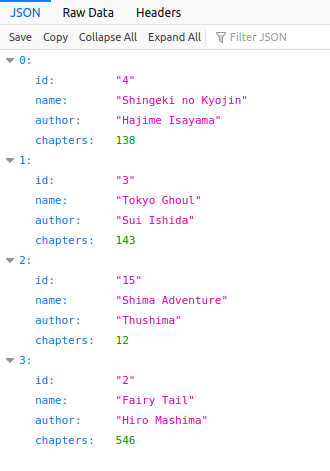

<h1 align="center">
  MangaAPI
</h1>
> O MangaAPI é uma api desenvolvida baseada na "Heroes API", projeto feito em uma livecoding do bootcamp Inter Java Developer - Digital Innovation One.

O MangaAPI tem como objetivo oferecer uma api reativa em Java para cadrasto e controle de mangás.

<div align="center"></div>
 <br/>
 
## Instalação

OS X & Linux:

```sh
java -jar mangaapi.jar
```

Windows:

```sh
java -jar mangaapi.jar
```

## :chart: Exemplo de uso

Para utilizar os recursos da API após a instalação, acesse a documentação de requisições suportadas, no seguinte endereço no navegador: http://localhost:8080/swagger-ui-manga-reactive-api.html

<!-- _Para mais exemplos, consulte a [Wiki][wiki]._  -->

## :wrench: Configuração para Desenvolvimento

Para continuar o desenvolvimento da API, você precisará dos seguintes requisitos:
- Java JDK em sua versão 8 ou superior;
- Maven;
- Conta na azure e as suas credenciais IAM;
- DynamoDB local;
- AWS CLI;
 
 Configure o AWS CLI e em seguida rode o DynamoDB em sua máquina local. Feito isso, preenche suas chaves no arquivo `application.properties` presente na pasta `resource`.


## :tada: Histórico de lançamentos

* 0.0.1
    * Projeto finalizado

## :fire: Meta

Elismar Silva – [@thushima](https://twitter.com/...) – elismarsilva.5@outlook.com

Distribuído sob a licença MIT. Veja `LICENSE` para mais informações.

[My profile here](https://github.com/Elismar13/)

## :construction_worker: Contributing

1. Faça o _fork_ do projeto (<https://github.com/yourname/yourproject/fork>)
2. Crie uma _branch_ para sua modificação (`git checkout -b feature/fooBar`)
3. Faça o _commit_ (`git commit -am 'Add some fooBar'`)
4. _Push_ (`git push origin feature/fooBar`)
5. Crie um novo _Pull Request_
